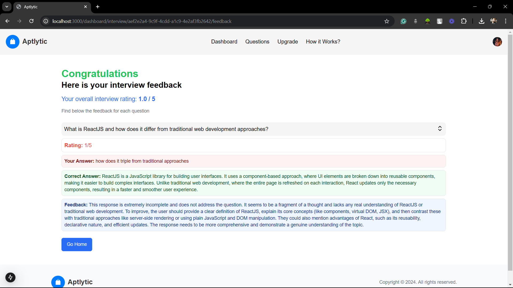

# Aptlytic - AI-Powered Mock Interview Platform


Aptlytic is an innovative AI-powered platform built to help users prepare for job interviews through simulated, AI-driven mock interviews. By combining advanced AI with detailed feedback, Aptlytic offers a comprehensive and interactive experience for users looking to sharpen their interview skills.

## Table of Contents
- [Features](#features)
- [Tech Stack](#tech-stack)
- [Getting Started](#getting-started)
- [Usage](#usage)
- [Subscription Plans](#subscription-plans)
- [Screenshots](#screenshots)
- [FAQ](#faq)
- [License](#license)

---

## Features
- **AI-Driven Interview Simulation** using Gemini AI
- **User Authentication** with Clerk
- **Question Management** powered by Drizzle ORM
- **Real-Time Feedback** and rating system
- **Performance Analysis** with detailed feedback for each answer
- **Subscription Tiers** for premium features and insights

## Tech Stack
- **Framework**: Next.js
- **Frontend**: React, Tailwind CSS
- **ORM**: Drizzle ORM
- **AI Integration**: Gemini AI
- **Authentication**: Clerk
- **Deployment**: Vercel

## Getting Started

### Prerequisites
- [Node.js](https://nodejs.org/) v14 or above
- [NPM](https://www.npmjs.com/) v6 or above

### Installation

Clone the repository:

```bash
git clone https://github.com/i-sayankh/aptlytic.git
cd aptlytic
```

Install dependencies:

```bash
npm install
```

Set up environment variables:

1. Create a `.env.local` file in the root directory.
2. Configure your environment variables as follows:

```plaintext
NEXT_PUBLIC_API_KEY=your-gemini-ai-api-key
CLERK_FRONTEND_API=your-clerk-frontend-api
DRIZZLE_DATABASE_URL=your-database-url
```

### Run the Application

Start the development server:

```bash
npm run dev
```

The app will be running at `http://localhost:3000`.

## Usage

1. **Register / Login**: Sign in with Clerk authentication.
2. **Start Mock Interview**: Access various question sets.
3. **Real-Time Feedback**: Receive immediate AI-generated feedback and insights on your performance.
4. **Upgrade for More**: Choose a subscription plan to unlock detailed analytics.

## Subscription Plans

- **Basic**: For new users - ₹199/month.
- **Pro**: Advanced analytics, personalized feedback - ₹499/month.
- **Enterprise**: Unlimited access and priority support - ₹999/month.

## Screenshots

 <!-- Add your actual screenshot paths -->



## FAQ

**How can I start a mock interview?**  
Sign in, navigate to the Dashboard, and select "Start Interview."

**How is my performance evaluated?**  
Our platform uses Gemini AI for real-time analysis and Drizzle ORM to manage the interview feedback and ratings.

**Can I get a refund?**  
For refund-related queries, please contact our support team at support@aptlytic.com.

## License
This project is licensed under the MIT License.
